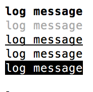
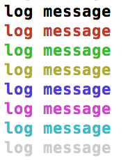
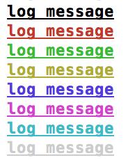
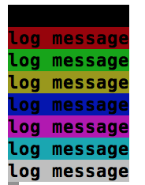
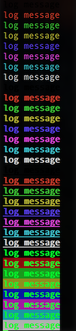
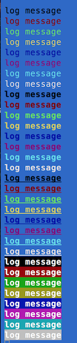

# smart-console

Simple JavaScript library that provides shorthand methods to manage console output with 0 dependencies. Customize your console output with different colors and format styles.

You can find the same library for the browser [here](https://github.com/achille1789/smart-console).

Every console object method (for more info see: [MDN](https://developer.mozilla.org/en/docs/Web/API/console) and
[Google API](https://developers.google.com/web/tools/chrome-devtools/console/console-reference)) has a name shortcut. Furthermore, predefined colors and style can be added to the log() messages.

__With this version some shorthand are changed__

## How to use it:
Insert the library as usual:
```javascript
npm install --save smart-console
```
```javascript
const {c} = require("smart-console");
```
Write 'c' instead of 'console' and use one of the method shortcuts. For example:
```javascript
console.log('test');
```
Becomes:
```javascript
c.l('test');
```
### Shorthands for console methods
All the shorthand methods use lower case
```javascript
c.a() = console.assert()
c.dir() = console.dir()
c.e() = console.error()
c.i() = console.info()
c.l() = console.log()
c.p() = console.profile()
c.pe() = console.profileEnd()
c.t() = console.time()
c.te() = console.timeEnd()
c.w() = console.warn()
c.j() = console.log() for logging JavaScript JSON objects
```


For log() messages you can use 3 different ways to insert a variable:
```javascript
let str = "Awesome";
c.l("Smart Console is " + str);
c.l("Smart Console is %s", str);
c.l(`Smart Console is ${str}`);
```

### Format styles for log() method
Format styles use lower case
```javascript
c.lb() = bold
c.lf() = faint
c.lu() = underline
c.ll() = blink
c.ln() = negative
c.lh() = hidden
```


### Colors for log() method
Colors use upper case
```javascript
c.lK() = black
c.lR() = red
c.lG() = green
c.lY() = yellow
c.lB() = blue
c.lM() = magenta
c.lC() = cyan
c.lW() = white
```

### Bold + Colors for log() method
Format styles use lower case and Colors use upper case
```javascript
c.lbK() = bold + black
c.lbR() = bold + red
c.lbG() = bold + green
c.lbY() = bold + yellow
c.lbB() = bold + blue
c.lbM() = bold + magenta
c.lbC() = bold + cyan
c.lbW() = bold + white
```

### Underline + Bold + Colors for log() method
Format styles use lower case and Colors use upper case, bold style is added by default
```javascript
c.luK() = underline + bold + black
c.luR() = underline + bold + red
c.luG() = underline + bold + green
c.luY() = underline + bold + yellow
c.luB() = underline + bold + blue
c.luM() = underline + bold + magenta
c.luC() = underline + bold + cyan
c.luW() = underline + bold + white
```




### Blink + Bold + Colors for log() method
Format styles use lower case and Colors use upper case, bold style is added by default
```javascript
c.llK() = blink + bold + black
c.llR() = blink + bold + red
c.llG() = blink + bold + green
c.llY() = blink + bold + yellow
c.llB() = blink + bold + blue
c.llM() = blink + bold + magenta
c.llC() = blink + bold + cyan
c.llW() = blink + bold + white
```

### Background Color + Bold for log() method
Background Colors use upper case, bold style is added by default
```javascript
c.lKBG() = blink + bold + black
c.lRBG() = blink + bold + red
c.lGBG() = blink + bold + green
c.lYBG() = blink + bold + yellow
c.lBBG() = blink + bold + blue
c.lMBG() = blink + bold + magenta
c.lCBG() = blink + bold + cyan
c.lWBG() = blink + bold + white
```


__Different console colors produce different effects and contrasts__





__If you forget the shortcuts' name:__
```javascript
> c.l(c);
```
[Git Hub Repository](https://github.com/achille1789/smart-console-nodejs)

[Report an Issue](https://github.com/achille1789/smart-console-nodejs/issues)

[](https://github.com/achille1789/smart-console-nodejs/blob/master/LICENSE)
